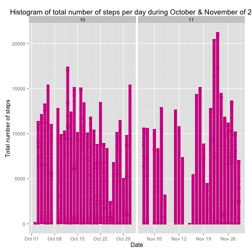
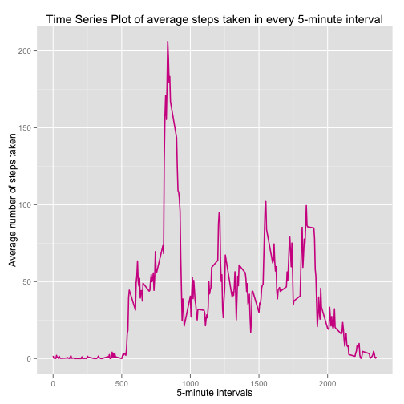
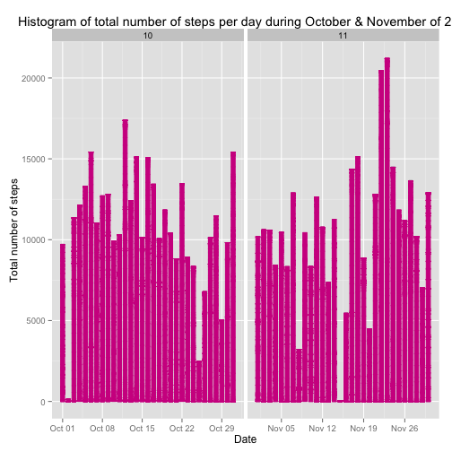
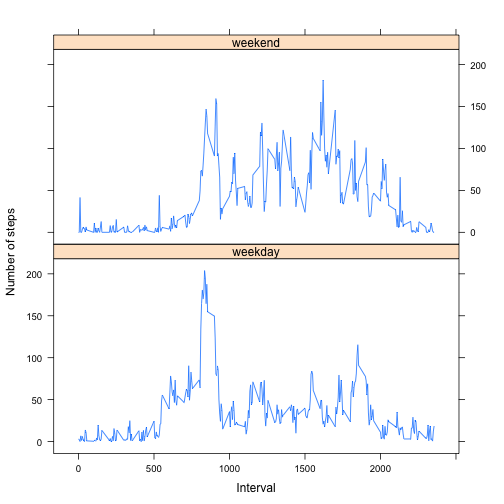

### Set options and libraries

```r
## Always make code visible
echo = TRUE;
## numbers >= 10^5 will be denoted in scientific notation,
## and rounded to 2 digits
options(scipen = 1, digits = 2)

# Install ggplot2 package
#install.packages("ggplot2")
## Load the library to create plots
library(ggplot2)

# Install and load mice package
#install.packages("mice")
library(mice)
```

## Loading and preprocessing the data

```r
## Unzip the dataset archive
unzip("activity.zip")

## Read the CSV, set the class of each variable
data = read.csv("activity.csv", 
                colClasses = c("integer", "Date", "factor"))

## Add month column for later use in histogram
data$month <- as.numeric(format(data$date, "%m"))

## Remove the missing values from the dataset
actDataComplete = data[complete.cases(data),] 

## Set name of each row in the complete dataset to be the row number
rownames(actDataComplete) <- 1:nrow(actDataComplete)

## Checking the summary of new data
summary(actDataComplete)
```

```
##      steps          date               interval         month     
##  Min.   :  0   Min.   :2012-10-02   0      :   53   Min.   :10.0  
##  1st Qu.:  0   1st Qu.:2012-10-16   10     :   53   1st Qu.:10.0  
##  Median :  0   Median :2012-10-29   100    :   53   Median :10.0  
##  Mean   : 37   Mean   :2012-10-30   1000   :   53   Mean   :10.5  
##  3rd Qu.: 12   3rd Qu.:2012-11-16   1005   :   53   3rd Qu.:11.0  
##  Max.   :806   Max.   :2012-11-29   1010   :   53   Max.   :11.0  
##                                     (Other):14946
```

```r
## Checking the structure of new data
str(actDataComplete)
```

```
## 'data.frame':	15264 obs. of  4 variables:
##  $ steps   : int  0 0 0 0 0 0 0 0 0 0 ...
##  $ date    : Date, format: "2012-10-02" "2012-10-02" ...
##  $ interval: Factor w/ 288 levels "0","10","100",..: 1 226 2 73 136 195 198 209 212 223 ...
##  $ month   : num  10 10 10 10 10 10 10 10 10 10 ...
```

## What is mean total number of steps taken per day?
1. Make a histogram of the total number of steps taken each day

```r
ggplot(actDataComplete, aes(date, steps)) + 
  geom_bar(stat = "identity", colour = "violetred", fill = "violetred", width = 0.7) + 
  facet_grid(. ~ month, scales = "free") + 
  labs(title = "Histogram of total number of steps per day during October & November of 2012", 
       x = "Date", y = "Total number of steps")
```

 

2. Calculate and report the mean and median total number of steps taken per day

```r
## Get the total number of steps taken each day
stepsPerDay <- aggregate(steps ~ date, data=actDataComplete, sum)$steps;
stepsPerDay
```

```
##  [1]   126 11352 12116 13294 15420 11015 12811  9900 10304 17382 12426
## [12] 15098 10139 15084 13452 10056 11829 10395  8821 13460  8918  8355
## [23]  2492  6778 10119 11458  5018  9819 15414 10600 10571 10439  8334
## [34] 12883  3219 12608 10765  7336    41  5441 14339 15110  8841  4472
## [45] 12787 20427 21194 14478 11834 11162 13646 10183  7047
```

```r
## Get the mean of total number of steps taken per day
mean(stepsPerDay)
```

```
## [1] 10766
```

```r
## Get the median of total number of steps taken per day
median(stepsPerDay)
```

```
## [1] 10765
```

## What is the average daily activity pattern?
1. Create a time series plot of 5-minute interval average number of steps taken across all days  

```r
## Calculate average steps taken for every 5-minute interval
avgStepsAll = aggregate(actDataComplete$steps,
                        list(interval = as.numeric(as.character(actDataComplete$interval))), 
                        FUN = "mean")
## Assign name to the means column 
names(avgStepsAll)[2] = "avgSteps"

## Create a line plot for intervals and average steps 
ggplot(avgStepsAll,aes(interval, avgSteps)) + 
  geom_line(color = "violetred", size = 0.75) + 
  labs(title = "Time Series Plot of average steps taken in every 5-minute interval", 
       x = "5-minute intervals", 
       y = "Average number of steps taken")
```

 

2. Which 5-minute interval contains maximum number of steps on average?

```r
## Gets the interval and number of steps
avgStepsAll[avgStepsAll$avgSteps == max(avgStepsAll$avgSteps), ]
```

```
##     interval avgSteps
## 104      835      206
```

## Imputing missing values
1. Calculate the total number of observations with missing values in dataset

```r
sum(is.na(data))
```

```
## [1] 2304
```

2. Devise a strategy to impute missing data

```r
## Show summary to find out which columns have NA values
summary(data)
```

```
##      steps           date               interval         month     
##  Min.   :  0    Min.   :2012-10-01   0      :   61   Min.   :10.0  
##  1st Qu.:  0    1st Qu.:2012-10-16   10     :   61   1st Qu.:10.0  
##  Median :  0    Median :2012-10-31   100    :   61   Median :10.0  
##  Mean   : 37    Mean   :2012-10-31   1000   :   61   Mean   :10.5  
##  3rd Qu.: 12    3rd Qu.:2012-11-15   1005   :   61   3rd Qu.:11.0  
##  Max.   :806    Max.   :2012-11-30   1010   :   61   Max.   :11.0  
##  NA's   :2304                        (Other):17202
```
We are going to use mice packe that has a function to impute missing values in dataset

3. Replace missing values with data

```r
## Get a subset of dataste for imputation. 
## The "steps" has missing values, while "month" is used because our imputation method requires a matrix  
stepsSubset = data[c("steps", "month")]

## set seed to always reproduce same results
set.seed(150)

#Impute the dataset (Be patient it may take some time..)
imputedData = complete(mice(stepsSubset))
```

```
## 
##  iter imp variable
##   1   1  steps
##   1   2  steps
##   1   3  steps
##   1   4  steps
##   1   5  steps
##   2   1  steps
##   2   2  steps
##   2   3  steps
##   2   4  steps
##   2   5  steps
##   3   1  steps
##   3   2  steps
##   3   3  steps
##   3   4  steps
##   3   5  steps
##   4   1  steps
##   4   2  steps
##   4   3  steps
##   4   4  steps
##   4   5  steps
##   5   1  steps
##   5   2  steps
##   5   3  steps
##   5   4  steps
##   5   5  steps
```

```r
## Replace missing values with imputed data
data$steps = imputedData$steps

## Confirm the missing values have been imputed
summary(data)
```

```
##      steps          date               interval         month     
##  Min.   :  0   Min.   :2012-10-01   0      :   61   Min.   :10.0  
##  1st Qu.:  0   1st Qu.:2012-10-16   10     :   61   1st Qu.:10.0  
##  Median :  0   Median :2012-10-31   100    :   61   Median :10.0  
##  Mean   : 37   Mean   :2012-10-31   1000   :   61   Mean   :10.5  
##  3rd Qu.: 12   3rd Qu.:2012-11-15   1005   :   61   3rd Qu.:11.0  
##  Max.   :806   Max.   :2012-11-30   1010   :   61   Max.   :11.0  
##                                     (Other):17202
```

4(a) Make a histogram of the total number of steps taken each day

```r
ggplot(data, aes(date, steps)) + 
  geom_bar(stat = "identity", colour = "violetred", fill = "violetred", width = 0.7) + 
  facet_grid(. ~ month, scales = "free") + 
  labs(title = "Histogram of total number of steps per day during October & November of 2012", 
       x = "Date", y = "Total number of steps")
```

 

4(b). Calculate and report the mean and median total number of steps taken per day

```r
## Get the total number of steps taken each day
stepsPerDay2 <- aggregate(steps ~ date, data=data, sum)$steps;
stepsPerDay2
```

```
##  [1]  9712   126 11352 12116 13294 15420 11015 12728 12811  9900 10304
## [12] 17382 12426 15098 10139 15084 13452 10056 11829 10395  8821 13460
## [23]  8918  8355  2492  6778 10119 11458  5018  9819 15414 10183 10600
## [34] 10571  8427 10439  8334 12883  3219 10439  8349 12608 10765  7336
## [45] 11256    41  5441 14339 15110  8841  4472 12787 20427 21194 14478
## [56] 11834 11162 13646 10183  7047 12901
```

```r
## Get the mean of total number of steps taken per day
mean(stepsPerDay2)
```

```
## [1] 10731
```

```r
## Get the median of total number of steps taken per day
median(stepsPerDay2)
```

```
## [1] 10600
```

The number of observations of number of steps without missing values was 15264
and after imputation we have number of onservations increased to 17568. Because of this increase in the number of observations, we a saw a decrease in number of mean and median.

## Are there differences in activity patterns between weekdays and weekends?
1. Add a factor variable to dataset, with two levels - "weekday" and "weekend". 

```r
## Extract unabbreviated weekday from the date and create a new column
data$weekdays <- factor(format(data$date, "%A"))

## Define the levels of this factor variable
levels(data$weekdays) <- list(weekday = c("Monday", "Tuesday","Wednesday","Thursday", "Friday"),
                                 weekend = c("Saturday", "Sunday"))

## Confirm the levels of weekdays
table(data$weekdays)
```

```
## 
## weekday weekend 
##   12960    4608
```
2. Make a panel plot for 5-minutes and average number of steps across all weekdays and weekends.

```r
avgStepsWeekly <- aggregate(data$steps, 
                      list(interval = as.numeric(as.character(data$interval)), 
                           weekdays = data$weekdays),
                      FUN = "mean")

names(avgStepsWeekly)[3] <- "avgSteps"

library(lattice)
xyplot(avgStepsWeekly$avgSteps ~ avgStepsWeekly$interval | avgStepsWeekly$weekdays, 
       layout = c(1, 2), 
       type = "l", 
       xlab = "Interval", 
       ylab = "Number of steps")
```

 
